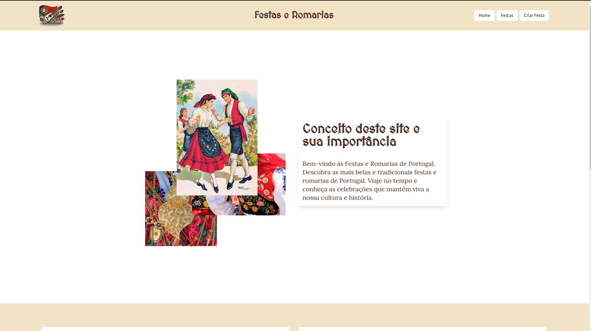
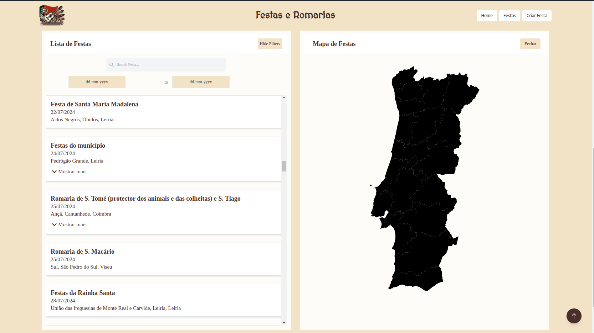
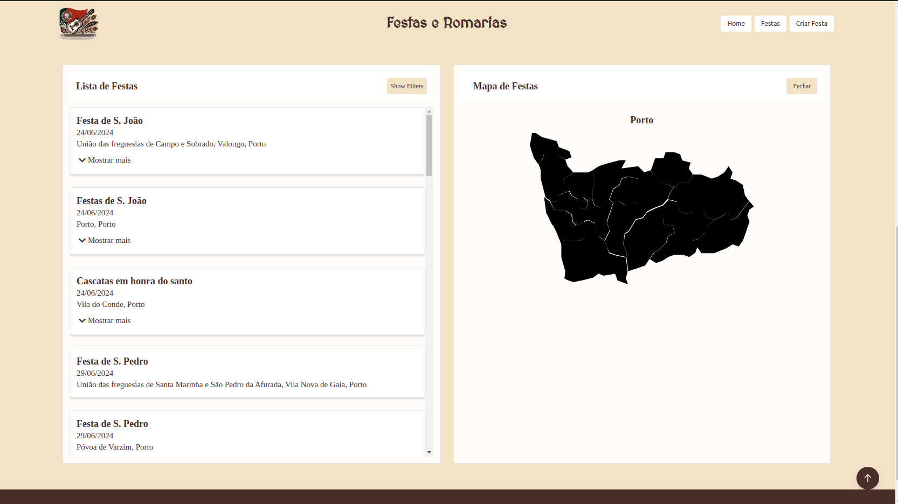
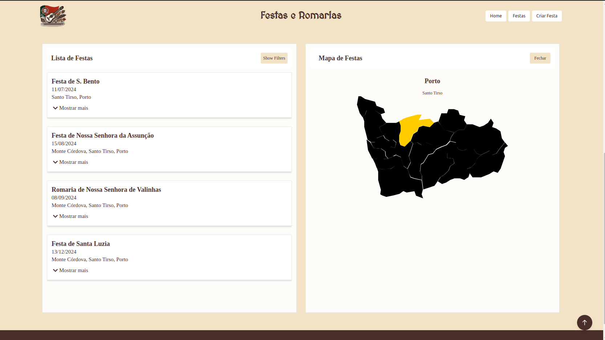
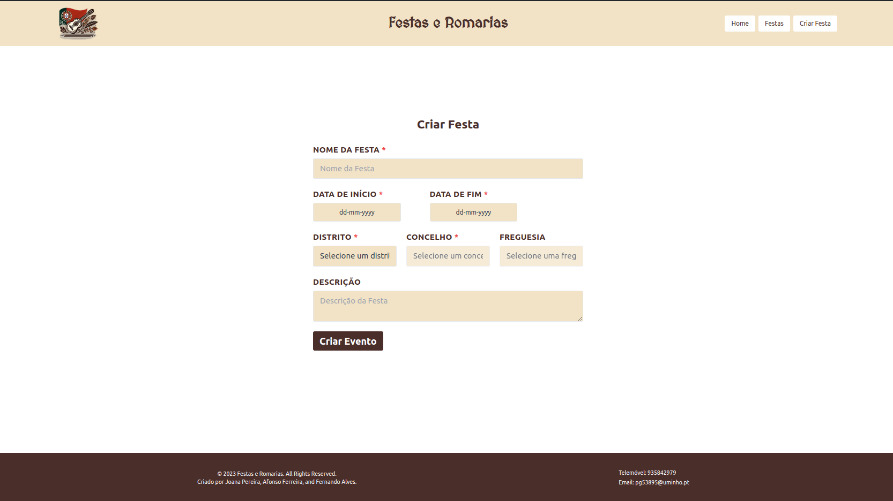

# TP_RPCW

Trabalho Prático de RPCW

## Realizado por:

- Afonso Ferreira (pg52669)
- Fernando Alves (pg54470)
- Joana Pereira (pg53895)

## Índice

1. [Introdução](#introdução)
2. [Recolha de Dados](#recolha-de-dados)
   - [Fonte de Dados](#fonte-de-dados)
   - [Estrutura das Informações no Site](#estrutura-das-informações-no-site)
   - [Exemplos de Formatos das Linhas](#exemplos-de-formatos-das-linhas)
3. [Desenvolvimento do Script de Web Scraping](#desenvolvimento-do-script-de-web-scraping)
   - [Tecnologias Utilizadas](#tecnologias-utilizadas)
   - [Estrutura do Script](#estrutura-do-script)
   - [Casos de Linhas e Desafios](#casos-de-linhas-e-desafios)
   - [Tratamento de Datas](#tratamento-de-datas)
4. [Estrutura do Ficheiro JSON](#estrutura-do-ficheiro-json)
5. [Criação da Ontologia](#criação-da-ontologia)
   - [Definição das Classes, Data Properties e Object Properties](#definição-das-classes-data-properties-e-object-properties)
   - [Inserção dos Indivíduos](#inserção-dos-indivíduos)
6. [Estrutura do Projeto](#estrutura-do-projeto)
7. [Estrutura do Projeto e Execução](#estrutura-do-projeto-e-execução)
   - [Pasta scrap](#pasta-scrap)
   - [Pasta festas](#pasta-festas)
8. [Como Executar o Projeto](#como-executar-o-projeto)
   - [Passo 1: Configurar a Ontologia no GraphDB](#passo-1-configurar-a-ontologia-no-graphdb)
   - [Passo 2: Instalar Dependências](#passo-2-instalar-dependências)
   - [Passo 3: Executar a Aplicação](#passo-3-executar-a-aplicação)
9. [Descrição do server.mjs](#descrição-do-servermjs)
10. [Consultar e Queries SPARQL](#consultar-e-queries-sparql)
    - [/festas](#festas)
    - [/distritos](#distritos)
    - [/concelhos?distrito=porto](#concelhosdistritoporto)
    - [/freguesias?concelho=gaia](#freguesiasconcelhogaia)
    - [/festas?distrito=porto](#festasdistritoporto)
    - [/criar_festa](#criar_festa)
11. [Demonstração](#demonstração)
12. [Conclusão](#conclusão)

## Relatório do Trabalho Prático

### Introdução

Para o trabalho de RPCW, decidiu-se criar um projeto focado nas festas e romarias tradicionais em Portugal. Acredita-se que este tema permite desenvolver um produto final interessante e detalhado, dado o interesse pela rica cultura e tradições portuguesas.

A inspiração veio do site TerraMater, que lista uma variedade de festas e romarias em Portugal. Este recurso mostrou a diversidade e a riqueza das festas e romarias no país, cada uma com suas próprias características únicas. No entanto, a informação disponível no site estava apenas em formato de texto, o que limitava a interação e a exploração dos utilizadores.

Com o objetivo de criar uma experiência mais interativa e envolvente, decidiu-se desenvolver um site que permitisse aos utilizadores explorar e descobrir festas e romarias de maneira intuitiva e visualmente atraente. Para isso, foi necessário realizar um levantamento extensivo de dados através de web scraping no site TerraMater e criar uma ontologia que organizasse a informação de maneira estruturada e acessível.

### Recolha de Dados

#### Fonte de Dados

As informações foram recolhidos do site [TerraMater](https://terramater.pt/temas/festas-e-romarias/).

#### Estrutura das Informações no Site

As informações no site estão organizadas da seguinte forma:

- Por regiões (uma página para cada província).
- Dentro de cada página, as festas são organizadas por trimestres e uma festa por linha.
- Cada linha de festa pode ter diferentes formatos.

##### Exemplos de Formatos das Linhas:

- freguesia , concelho , data - nome : descricao
- freguesia , concelho , data - nome . descricao
- freguesia , concelho , data - nome , descricao
- freguesia , concelho , data : nome . descricao
- freguesia , concelho , data : nome , descricao
- concelho , data - nome , descricao
- concelho , data - nome . descricao
- concelho , data : nome , descricao
- concelho , data : nome . descricao
- freguesia, concelho - data+nome : descricao
- freguesia, concelho, data+nome . descricao

Estes foram alguns dos diferentes formatos que foram encontrados e representaram um desafio significativo para a criação de um script capaz de extrair as informações de maneira consistente.

### Desenvolvimento do Script de Web Scraping

#### Tecnologias Utilizadas

- **Bibliotecas:** BeautifulSoup para web scraping, Pandas para manipulação de dados, Dateutil para manipulação de datas, FuzzyWuzzy para correspondência aproximada de strings.
- **Python:** Linguagem de programação utilizada para o desenvolvimento do script.

#### Estrutura do Script

O script realiza as seguintes tarefas principais:

1. **Configuração do User-Agent:** Para evitar bloqueios durante o scraping.
2. **Leitura e Processamento do Ficheiro de Metadados:** Utilização de um ficheiro `FreguesiasPortugalMetadata.xlsx` para obter informações sobre regiões, distritos, concelhos e freguesias obtido do site [dados.gov](https://dados.gov.pt/pt/).
3. **Definição de Funções para Extração de Informações:** Funções específicas para lidar com diferentes formatos de linhas de festas e para converter datas em formatos padronizados.
4. **Função Principal de Web Scraping:** Coleta de dados de cada URL das páginas de regiões e armazena as informações extraídas em estruturas de dados apropriadas.

#### Casos de Linhas e Desafios

Como mencionado anteriormente, os diferentes formatos de linhas exigem que o script de scraping seja flexível e robusto para capturar as informações corretamente. A função de parsing analisa cada linha e tenta identificar os componentes (freguesia, concelho, data, nome, descrição) com base em padrões de texto.

Os diversos formatos das linhas apresentaram desafios significativos. Por exemplo:

- Linhas que incluem freguesia, concelho, data e descrição em diferentes combinações e ordens.
- Linhas que utilizam diferentes pontuações e delimitadores para separar as informações.
- Datas que são apresentadas em formatos variados, incluindo expressões como "primeiro domingo de julho".

Para garantir a coerência dos nomes e associar corretamente os distritos com as freguesias e concelhos, foi utilizado um JSON criado a partir do ficheiro `FreguesiasPortugalMetadata.xlsx`, mencionado anteriormente. Este ficheiro forneceu uma referência estruturada para validar e completar as informações extraídas durante o processo de scraping.

#### Tratamento de Datas

As datas no site vêm em diferentes formatos, como "14 de novembro" ou "domingos de pascoa". Para padronizar as datas, foram criadas funções específicas para converter expressões como "primeiro domingo de julho" em um formato `dd/mm/yyyy`.

### Estrutura do Ficheiro JSON

O ficheiro JSON final possui a seguinte estrutura, contendo tanto a informação das regiões, distritos, concelhos e freguesias como a informação de cada festa em específico:

```json
{
  "regioes": [
    {
      "regiao": "beira_litoral",
      "distritos": [
        {
          "distrito": "Aveiro",
          "concelhos": [
            {
              "concelho": "Águeda",
              "freguesias": ["Aguada de Cima", "Fermentelos"]
            }
          ]
        }
      ]
    }
  ],
  "festas": [
    {
      "festa_id": 1,
      "Nome": "Cortejo dos Reis",
      "Descrição": "com pequeno auto teatral e leilão das ofertas",
      "Data Início": "06-01-2024",
      "Data Fim": "06-01-2024",
      "Região": "beira_litoral",
      "Distrito": "Aveiro",
      "Concelho": "Sever do Vouga",
      "Freguesia": "Talhadas"
    }
  ]
}
```

### Criação da Ontologia

#### Definição das Classes, Data Properties e Object Properties

Para a criação da ontologia, foram definidas várias classes, data properties e object properties no Protégé. A seguir, apresentamos um resumo das definições:

**Classes:**

- Regiao
- Distrito
- Concelho
- Freguesia
- Festa

**Object Properties:**

- regiaoTemFesta
- distritoTemFesta
- concelhoTemFesta
- freguesiaTemFesta
- ocorreRegiao
- ocorreDistrito
- ocorreConcelho
- ocorreFreguesia
- pertenceRegiao
- pertenceDistrito
- pertenceConcelho
- temDistrito
- temConcelho
- temFreguesia

**Data Properties:**

- nome
- descricao
- dataInicio
- dataFim

#### Inserção dos Indivíduos

Foi realizada a inserção dos indivíduos no arquivo TTL a partir do JSON criado. O script `ontologia.py` lê o ficheiro JSON e gera o arquivo TTL com os indivíduos.

### Estrutura do Projeto

```plaintext
TP_RPCW
📦festas
┣ 📂node_modules
┣ 📂public
┣ 📂src
┃ ┣ 📂assets
┃ ┃ ┣ 📂mapa
┃ ┃ ┣ 📜festas.json
┃ ┃ ┣ 📜fotos_juntas.png
┃ ┃ ┣ 📜fundo.jpg
┃ ┃ ┗ 📜romaria.png
┃ ┣ 📂components
┃ ┃ ┣ 📜Descricao.js
┃ ┃ ┣ 📜Festa.js
┃ ┃ ┣ 📜Festas.js
┃ ┃ ┣ 📜Footer.js
┃ ┃ ┣ 📜Header.js
┃ ┃ ┣ 📜Mapa.css
┃ ┃ ┗ 📜Mapa.js
┃ ┣ 📂pages
┃ ┃ ┣ 📜Criar.js
┃ ┃ ┗ 📜Home.js
┃ ┣ 📜App.css
┃ ┣ 📜App.js
┃ ┣ 📜App.test.js
┃ ┣ 📜index.css
┃ ┣ 📜index.js
┃ ┣ 📜logo.svg
┃ ┣ 📜ontologia_teste.ttl
┃ ┣ 📜reportWebVitals.js
┃ ┗ 📜setupTests.js
┣ 📜.gitignore
┣ 📜README.md
┣ 📜package-lock.json
┣ 📜package.json
┣ 📜server.mjs
┗ 📜tailwind.config.js
📦scrap
 ┣ 📂dados
 ┣ 📜README.md
 ┣ 📜datas.json
 ┣ 📜distritos_concelhos_freguesias.json
 ┣ 📜festas.json
 ┣ 📜ontologia.py
 ┣ 📜outros.txt
 ┣ 📜scraper.py
 ┣ 📜script_regioes.py
 ┣ 📜sem_distritos.txt
 ┣ 📜testes.py
 ┗ 📜urls.txt
```

#### Estrutura do Projeto e Execução

#### Pasta `scrap`

A pasta `scrap` contém scripts e dados relacionados à criação do JSON e da ontologia. Esta parte do projeto envolve:

- **Recolha de Dados:** Scripts para realizar web scraping e extrair informações sobre as festas.
- **Processamento de Dados:** Arquivos JSON intermediários e finais, além de scripts para manipulação e limpeza de dados.
- **Criação da Ontologia:** Scripts como `ontologia.py` que geram o arquivo TTL a partir do JSON criado.

### Pasta `festas`

A pasta `festas` contém o código da aplicação web que exibe as festas. Esta parte do projeto envolve:

- **Frontend:** Componentes React que constroem a interface de usuário.
- **Backend:** Um servidor para servir a aplicação, se necessário.
- **Configurações:** Arquivos de configuração para dependências, estilo e outros aspectos da aplicação.

### Como Executar o Projeto

#### Passo 1: Configurar a Ontologia no GraphDB

1. **Importar a Ontologia:** A ontologia deve ser carregada no GraphDB com o nome `FestasRomarias`.
2. **Inserir Dados:** Insira o ficheiro JSON `festas.json` na ontologia.

#### Passo 2: Instalar Dependências

1. Navegue até a pasta `festas`.
2. Execute o comando:

```bash
npm install
```

##### Passo 3: Executar a Aplicação

Ainda na pasta festas, execute o comando:

```bash
npm start
```

O comando acima abrirá uma janela no navegador no endereço http://localhost:3000, onde a aplicação estará rodando.

#### Dependências

Certifique-se de que possui as seguintes ferramentas instaladas:

- **Node.js e npm:** Para gerenciar dependências e scripts de build.
- **GraphDB:** Para hospedar a ontologia e os dados das festas.

### Descrição do server.mjs

O ficheiro server.mjs serve para fazer queries à base de dados (ontologia) hospedada no GraphDB, que está disponível no localhost:7200. O resultado das queries pode ser acessado no localhost:5000. A aplicação frontend faz fetch para essa porta para obter os dados necessários.

### Consultar e Queries SPARQL

As queries SPARQL utilizadas foram testadas no GraphDB para garantir que os dados retornados estivessem corretos. Aqui estão alguns exemplos de queries utilizadas:

#### `/festas`

**Descrição:** Obter todas as festas.

#### `/distritos`

**Descrição:** Obter todos os distritos.

#### `/concelhos?distrito='Porto'`

**Descrição:** Obter todos os concelhos de um determinado distrito.

#### `/freguesias?concelho='Gaia'`

**Descrição:** Obter todas as freguesias de um determinado concelho.

#### `/festas?distrito='Porto'`

**Descrição:** Obter todas as festas de um determinado distrito.

#### `/criar_festa`

**Descrição:** Adicionar uma festa à ontologia.

### Demonstração

#### Página Inicial

A página inicial está dividida em duas secções principais:

##### Parte Superior:

Apresenta uma breve descrição do que o utilizador irá encontrar no site e a importância do mesmo. O objetivo é proporcionar uma visão geral sobre a relevância das festas e romarias tradicionais em Portugal.



##### Lista de Festas e Mapa:

Ao descer um pouco, encontra-se uma lista de festas à esquerda e um mapa à direita. Inicialmente, são apresentadas todas as festas de Portugal.
O mapa permite selecionar um distrito, filtrando assim as festas para exibir apenas as pertencentes ao distrito escolhido. É possível clicar num concelho dentro do distrito para mostrar apenas as festas desse concelho específico.

Existe ainda uma funcionalidade de filtro disponível em qualquer momento, permitindo a filtragem das festas pelo nome ou por datas de início e fim.

Nota: As festas mostradas inicialmente têm como ponto de partida a data atual (data em que o utilizador está a ver o site). No entanto, é possível filtrar para exibir festas mais antigas, ajustando a data de início.







#### Criar Festa

A página "Criar Festa" permite aos utilizadores inserir novas festas no sistema. A interface inclui campos para o nome da festa, datas de início e fim, distrito, concelho, freguesia e uma descrição detalhada.

Nota: Os campos marcados com \* são de preenchimento obrigatório.



### Conclusão

Este trabalho prático permitiu a aplicação de várias técnicas de web scraping, processamento de dados e manipulação de ontologias para criar uma aplicação web completa que exibe informações sobre festas tradicionais em Portugal. A utilização de ferramentas como BeautifulSoup, Pandas, e GraphDB foi essencial para o sucesso do projeto.

#### Desafios Enfrentados

Durante o desenvolvimento do projeto, foram enfrentados diversos desafios, tais como:

- Diversidade de Formatos de Dados
- Tratamento de Datas
- Validação de Dados das freguesias, concelhos e dsitritos

Felizmente, estes desafios foram ultrapassados com sucesso, resultando numa aplicação funcional e útil.

#### Possíveis Melhorias
Há várias áreas onde a aplicação pode ser melhorada para oferecer uma experiência ainda mais rica e funcional aos utilizadores:

- Filtro por Múltiplos Concelhos: Implementar a possibilidade de selecionar múltiplos concelhos no mapa, permitindo aos utilizadores filtrar festas de várias localidades ao mesmo tempo. Esta funcionalidade aumentaria a flexibilidade e a utilidade do filtro geográfico.
- Interatividade Avançada no Mapa: Melhorar a interatividade do mapa, como a implementação de animações ao passar o rato sobre os distritos e concelhos, poderia-se mostrar o nome da região.
- Melhoria da Interface de Utilizador: Continuar a refinar a interface do utilizador para tornar a navegação e a interação com o site mais intuitivas e agradáveis.

Estas melhorias visam não só enriquecer a experiência dos utilizadores, mas também garantir a sustentabilidade e a evolução contínua da aplicação, permitindo que mais pessoas descubram e apreciem as tradições culturais de Portugal.